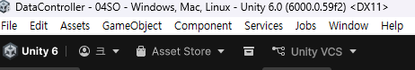
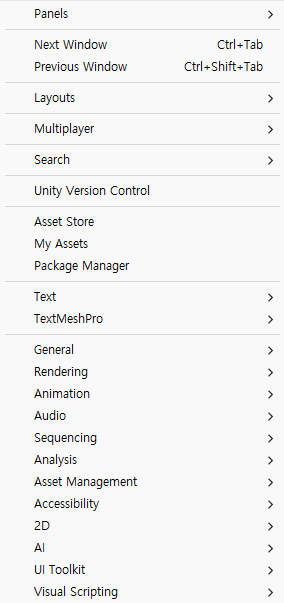
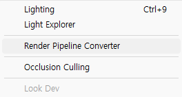
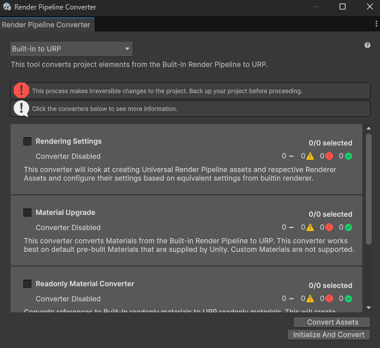
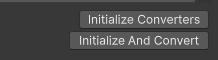

# 임포트한 에셋이 깨졌을 경우(마젠타)

1. 화면 상단에 Windows메뉴 -> 

2. Rendering 마우스 올려서 오른쪽 활성화 -> 

3. Render Pipline Converter 클릭 ->

4. 나오는 화면에서 체크박스 모두 체크 -> 

5. Initialize Converters 클릭 -> 

6. Conert Assets