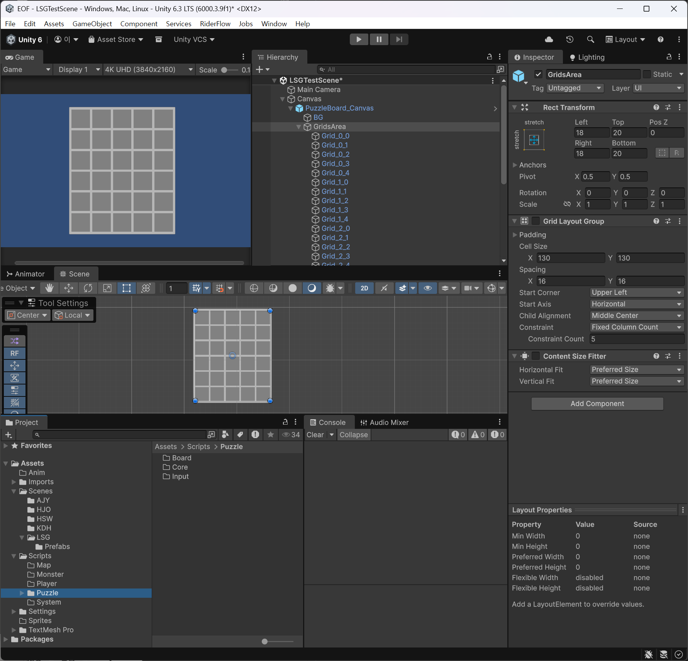
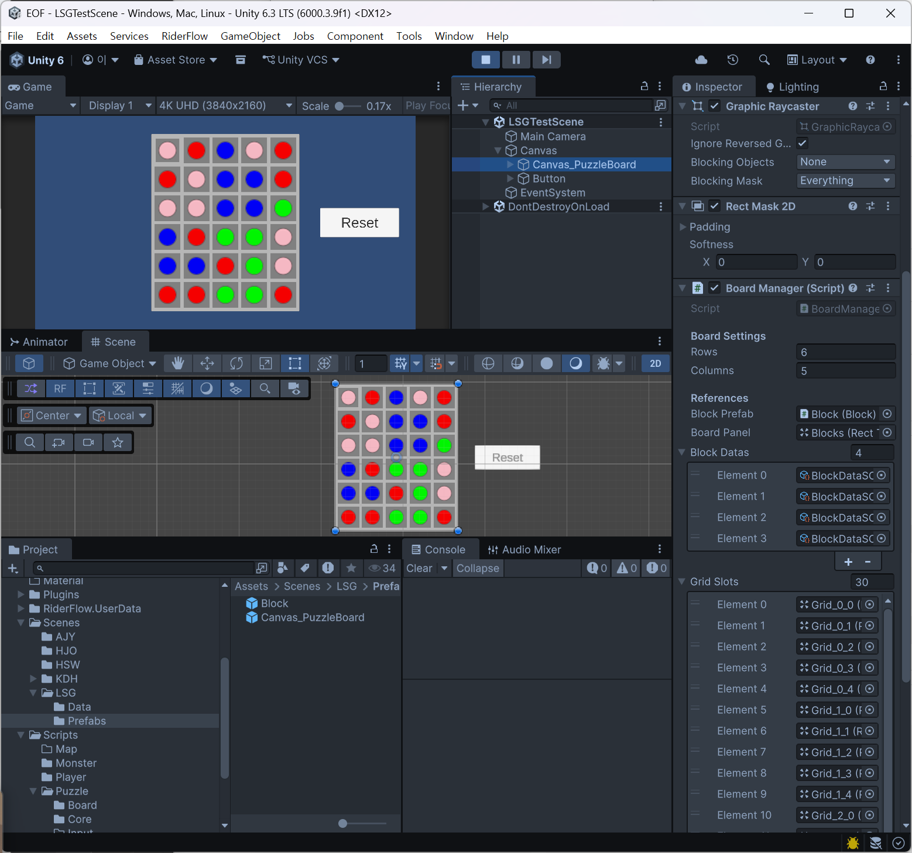
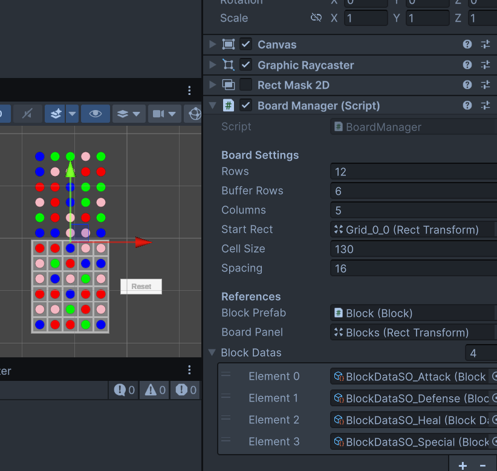

# TEMFKing_작업 노트

**작성자**: 이성규  
**게임명**: 스러진 왕의 영원한 행진(The Eternal March of the Fallen King)  
**작성일**: 2026-03-23  
**최종 수정**: 2026-03-24  

## 프로젝트 개요

- **진행 기간**: 2026.03.20(금)~2026.04.09(목)
- **개발 환경**: Unity / C# / URP 2D
- **유니티 버전**: 6.3 LTS

# 작업 일지

## Day 1 — 2026-03-20

기획팀과 회의 및 플밍팀 회의 시간

## Day 2 — 2026-03-23

프로젝트 기초 세팅을 공유 받음

작업 브랜치를 만든 후 기초 문서들 생성

R&D 시작

### 테스트용 UI 및 프리팹 제작

**테스트용 더미 UI 그리드**

유니티상에서 개발에 사용할 테스트 더미 UI 작성 (5*6 그리드)  
빠른 구성을 위해 GridLayoutGroup 사용 후 배치 확정되면 비활성화.  
런타임에서 레이아웃 재계산 비용을 없애기 위함.

**블록 프리팹 생성**

블록을 그리드 슬롯 위에 배치하는 구조.

- 그리드 슬롯: Raycast Target Off — 블록에 가려져서 입력을 받을 일이 없음
- 블록: Raycast Target On — 드래그 입력을 받아야 하므로 필수

블록이 자기 그리드 좌표(x, y)를 들고 있어서,
드래그 시작 시 출발 좌표를 알 수 있고
드롭 시 인접 슬롯 위에 놓였는지로 스왑 여부를 결정한다.

드래그는 인접 1칸으로 제한하며,
가로/세로 중 큰 축만 허용하여 대각선 이동을 방지한다.

2D UI라 Physics Raycast나 Trigger는 적합하지 않음.
RectTransformUtility.RectangleContainsScreenPoint로
드롭 위치가 인접 그리드 슬롯(상하좌우 4칸) 안에 있는지 판정한다.
해당 슬롯 안이면 스왑, 아니면 원위치 복귀. 

### Grid2D 스크립트 작성

**기본 게임플레이**
기본 매치3 게임플레이는 2D 그리드를 타일(블록)로 채운 뒤, 플레이어가 타일을 교환하여 매치를 만드는 것이다. 매칭된 타일은 제거되고, 위의 타일들이 떨어져 빈 칸을 채우며, 필요에 따라 새 타일이 추가된다.

### 2D 그리드

게임 로직과 스킨 모두 2D 그리드를 다뤄야 하므로, 이를 쉽게 하기 위한 제네릭 직렬화 가능 `Grid2D<T>` 구조체를 만든다. 내부 셀 배열로 데이터를 저장하고 2D 크기를 `int2`로 추적하며, 생성자 메서드에 전달한다.

**다차원 배열이 아닌 이유**
Unity 직렬화가 다차원 배열을 지원하지 않아서다.
1차원 배열에 y * width + x로 인덱싱하면 직렬화도 되고, 캐시 친화적이라 순회 성능도 더 좋다. 제네릭 구조체로 감싸서 인덱서를 제공하면 외부에서는 2차원처럼 쓰면서 내부는 1차원이다.

- `IsUndefined` — 셀이 채워지지 않은 상태에서 그리드 접근을 방지
- `this[int x, int y]` / `this[int2 c]` — 2차원 좌표로 셀에 접근하는 인덱서
- `AreValidCoordinates(int2 c)` — 좌표가 그리드 범위 내인지 확인
- `Swap(int2 a, int2 b)` — 두 좌표의 데이터를 교체 (블록 스왑에 활용)

### 블록 재사용 방식 결정 (풀링 대체)

- 30개의 블록은 풀링하기엔 오버 엔지니어링이므로 쓰지않는다. 다만 매칭 될때마다 파괴하는건 메모리 효율에 좋지 않으므로 매칭된 블록을 즉시 파괴하는 대신, 투명하게(Alpha 0) 만들거나 화면 밖 저 멀리 보낸다.
- 위에서 새로운 블록이 내려와야 할 때, 방금 숨겨둔 블록을 그리드 맨 위쪽 좌표로 순간 이동시킨 뒤 데이터(색상/타입)만 바꾸어 다시 아래로 떨어뜨린다.
- 타일(블록)이 떨어질때는 위에서 아래 방식이지만 그리드 밖에서는 안보이게 한다.
  - 마스킹 기법 사용(RectMask2D)
  - RectMask2D 컴포넌트를 퍼즐 보드 캔버스 최상단에 추가한다

### 데이터 및 상태 열거형(Enum) 작성
- **BlockType**: 블록의 타입을 담을 열거형 스크립트 작성 (None, Attack, Defense, Heal, Special)
- **EBlockStatus**: 블록의 상태를 담을 열거형 스크립트 작성 (None, Freeze 등)

### BlockDataSO 스크립트 작성 (ScriptableObject)
- 타입별 데이터를 관리하는 데이터 컨테이너 구현.
- EBlockType type: 블록의 타입.
- Color color: 임시 컬러 세팅 (나중에 스프라이트로 교체 예정).
- Sprite sprite: 나중에 아트 리소스가 들어오면 교체할 용도.
- float effectValue: 블록당 효과 수치 (공격 5, 방어 2 등 매칭 시 전투 시스템에 전달).

### Block 스크립트 작성 (MonoBehaviour)
- 그리드에 채워질 기본 단위인 블록 오브젝트에 붙는 런타임 스크립트.
- 인스턴스별 런타임 데이터 관리: BlockDataSO data(SO 참조), EBlockStatus status(상태), int2 gridPosition(그리드 좌표).
- Image 컴포넌트를 참조하여 SetBlock 등에서 타입 세팅 및 비주얼을 반영함.
- 처음 생성될 때, 또는 화면 밖에서 재배치되어 내려올 때 블록 상태를 초기화하는 기능 추가.
- 위치 설정(SetPosition) 및 상태 설정(SetStatus) 메서드 추가.
- 매칭되어 터질 때를 위해 파괴 대신 비활성화하는 Despawn 스크립트 추가.

### SGrid2D 스크립트 개선
- 보드 전체를 비우는 초기화 메서드(`Clear()`) 추가.
- `yield return`과 튜플을 사용해 모든 셀을 순회하는 반복자(`GetAllCells()`)를 추가하여 편의성을 높임.

## Day 3 — 2026-03-24

아침 회의 및 에셋 세팅 진행

### BoardManager 스크립트 작성

그리드와 블록까지 기본 단위 스크립트를 작성했으므로 이제 게임 보드를 채우고 관리하기 위한 스크립트를 작성한다.

우선 블록을 담을 그리드 변수 필요.
보드관리자 스크립트니 보드의 정보를 담을 변수 선언.
행과 열의 갯수를 설정한다.

- 스폰할 블록 프리팹
- 블록들이 생성될 부모 캔버스 패널
- 스폰 시 랜덤으로 부여할 SO 데이터 풀
- 스폰 위치(그리드) 계산용 시작 좌표 및 셀 간격 세팅
- 초기 생성시 보드를 초기화 호출한다.
- 블록으로 그리드 구조 데이터를 생성하고
- 기존 수동 할당 방식에서 동적 계산 방식으로 전환하여, `BoardLayout` 클래스를 통해 산출된 UI 좌표에 맞춰 블록 객체를 생성 및 배치한다.
- 생성된 블록에는 SO 데이터를 통해 랜덤하게 데이터를 초기화하며 랜덤 스폰을 완료한다.
- 캔버스 기반 UI 객체이므로 위치 할당 시 `RectTransform.anchoredPosition`을 사용하며, 슬롯 앵커는 Center로 통일하여 좌표가 어긋남을 방지함.
- `ResetBoard` 로직 추가: 불필요한 파괴 및 재생성을 하지 않고 기존 오브젝트를 유지하되 데이터만 교체하며 비주얼 및 데이터를 갱신한다.

랜덤 스폰이 완료된 모습, 아직 초기 매칭 방지 로직은 없고 보드 초기화 기능 정상 동작 확인.

### 퍼즐 로직 보강 논의

---

**보드 구조**

전체 그리드를 12행 x 5열(보이는 6행 + 버퍼 6행)로 통합 관리한다. `SGrid2D<Block>`은 하나만 쓰고, y 0~5가 버퍼 영역, y 6~11이 플레이 영역이다. 그리드 슬롯 오브젝트는 60개(보드 30 + 버퍼 30)를 배치하되, 보드 패널에 `RectMask2D`를 걸어서 버퍼 행은 시각적으로 가린다.

**블록 라이프사이클**

블록 GameObject는 초기 생성 후 파괴하지 않는다. 매치 소멸 시 연출(알파 off 등) 후 비활성 상태로 전환하고, 버퍼 최상단 슬롯으로 논리적 재배치한 뒤 새 SO 데이터로 `Init()`하여 재사용한다.

**낙하 로직**

매치 제거 후 각 열별로 빈 칸을 아래부터 탐색한다. 빈 칸 위에 있는 블록들을 순차적으로 아래로 당기고, 버퍼 행의 블록들이 보드 영역으로 내려온다. 이동은 DoTween `DOAnchorPos`로 목표 슬롯 좌표까지 연출하며, 열별로 약간의 delay를 주어 캐스케이드 느낌을 준다.

**블록 상태 관리**

블록에 상태 구분을 둔다(활성 / 연출중 / 비활성 등). 연출중·비활성 블록은 입력 및 매칭 판정에서 제외한다. 낙하 완료 후 전체 블록이 활성 상태가 되면 보드 전체 매칭 스캔을 수행한다.

**시드 기반 초기화**

`UnityEngine.Random` 대신 `System.Random` 인스턴스를 사용한다. 스테이지 SO에 시드값 필드를 두고, CSV 파이프라인으로 세팅한다. 시드가 있으면 해당 시드로, 없으면 순수 랜덤으로 보드를 생성한다.

**매칭 판정 범위**

매칭 체크는 보이는 보드 영역(y 6~11)에서만 수행한다. 버퍼 행 블록은 내려와서 보드에 안착한 시점부터 판정 대상이 된다.

버퍼 영역까지 위치 보정해서 블록 생성 완료된 모습  
마스킹은 일부러 끈 상태

---

### 블록 드래그 시스템 개발

퍼즐에 한해서만 동작할 블록 드래그처리를 담당할 기능을 개발한다.

inputAction을 활용하기 보다는 UI에서 지원하는 Handler 이벤트를 활용해 구현한다.

IPointerDownHandler + IDragHandler + IPointerUpHandler

UI에 클릭했을때 Down, 그 상태에서 드래그할때 Drag, 클릭을 멈추고 땔때 Up

**Block**
- 드래그 시작점을 저장
- 스와이프 방향 판정
  - 델타값에서 상하좌우 중 가장 큰 축으로 (OnPointerUp 또는 OnDrag에서 임계값 넘었을 때)
- 판정된 방향 + 자신의 그리드 좌표를 BoardManager에 전달

**BoardManager**
- 스왑 요청 수신 (어떤 블록이 어느 방향으로)
- 인접 좌표 유효성 검사 (보드 범위 내인지, 버퍼 행 아닌지)
- 두 블록의 그리드 데이터 + 좌표 교환

- Block.cs 에서 Board 매니저를 연결해서 의존성 주입(DI)
  - BlockDragHandler에서 보드를 안찾아도된다.
  - BoardManager에서 블록을 생성할때 자신을 연결해준다.

- `IBoardInteractable` 인터페이스 도입으로 Block/DragHandler가 BoardManager 구체 타입에 의존하지 않도록 분리
  - `CanInteract(int2 pos)`: 버퍼 영역 및 블록 상태 기반 입력 차단
  - `OnSwipeBlock(int2 pos, Vector2Int dir)`: 스왑 요청 수신

- `_isDragging` 플래그로 `CanInteract` 실패한 터치가 `OnPointerUp`까지 흘러가는 엣지 케이스 차단

- 임계값(DRAG_THRESHOLD = 30px) 미만의 미세 터치는 무시하여 의도치 않은 스와이프 방지